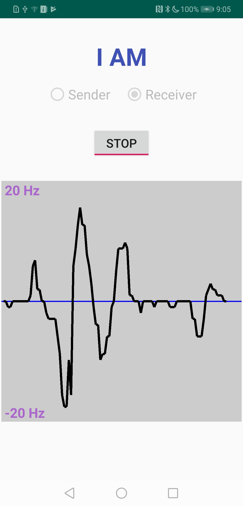

# dtc-doppler-illustrator

&nbsp;
  

Illustrating acoustic Doppler effect and relative velocity using Android phones

Sender: Emitting inaudible sounds. Three senders can be supported in current version. Each sender uses a frequency to emit sounds. Different senders use different frequencies.

Receiver: calculating and displaying the relative velocity between sender and receiver

<!-- ## Screenshot

   

(Screenshot from Huawei Mate 20) -->

## Code Structure

It has mainly three components. One for transmitting signals, one for analyzing received signals, and another one for sending data to the server. 

### Sender
The sender part is implemented in the `PlaySound.java` class, which emits sounds of a single frequency. Three phones are set as sender 1, sender 2, sender 3 to  send out sounds. The frequency of them are 18.5 KHz, 19.5KHz and 20.5KHz. You can easily change to other frequencies if you like. You can also define more senders as long as they use different frequency bands. 

### Receiver
The receiver part is implemented in the `AnalyzeFrequency.java` class. The acoustic signals go through the following steps.

1)  Receive sounds. 

2)  Filtering. We apply a bandpass filter that only allows signals within \[18KHz, 21KHz\]. There is a very convenient Android app named *FIR Filter Designer* that can generate Java code for you. The higher order of filters causes greater computation overhead.

2)  Undersampling and overlapping. Undersampling is applied to increase the frequency resolution and overlapping is used to increase temporal fidelity. We use 8X undersampling and 0.875 overlapping.

3)  Window function. We apply Blackman-Harris window to smooth the spectrum. You can try other window functions as well. <https://en.wikipedia.org/wiki/Window_function>

4)  Fast-Fourier Transform (FFT). 

5)  Calculate Doppler shift. Since we know that the sender's signal is 19 KHz, we only need to calculate the received frequency (with the strongest magnitude) minus 19 KHz.

6)  Caculate relative velocity between a sender and the receiver based on this Euqation ∆v = ∆f*c/fo, ∆f is the frequence offset, c is the speed of sounds, fo is the emitted frequency f

7)  Draw relative velocity on screen. 

### Send data

The sending daya part is implented in the 'MyHttpConnection.java' class. 

## More Details

This repo is based on the following papers and implementations:  
*   [\[Paper 1\]](https://www.huanlezhang.com/publication/conference/dopenc_mobicom_16/paper.pdf) DopEnc: Acoustic-based Encounter Profiling Using Smartphones, *published in ACM Conference on Mobile Computing and Networking (MobiCom)*, 2016   
*   [\[Paper 2\]](https://www.huanlezhang.com/publication/journal/dopenc_tmc_18/paper.pdf) An Acoustic-Based Encounter Profiling System, *published in IEEE Transactions on Mobile Computing (TMC)*, 2018
*   https://github.com/dtczhl/dtc-doppler-illustrator

<!-- Please also consider to cite my papers. Thank you. -->

<!-- ## Phones Tested
*   Huawei Mate 20
*   Google Pixel 2 -->
